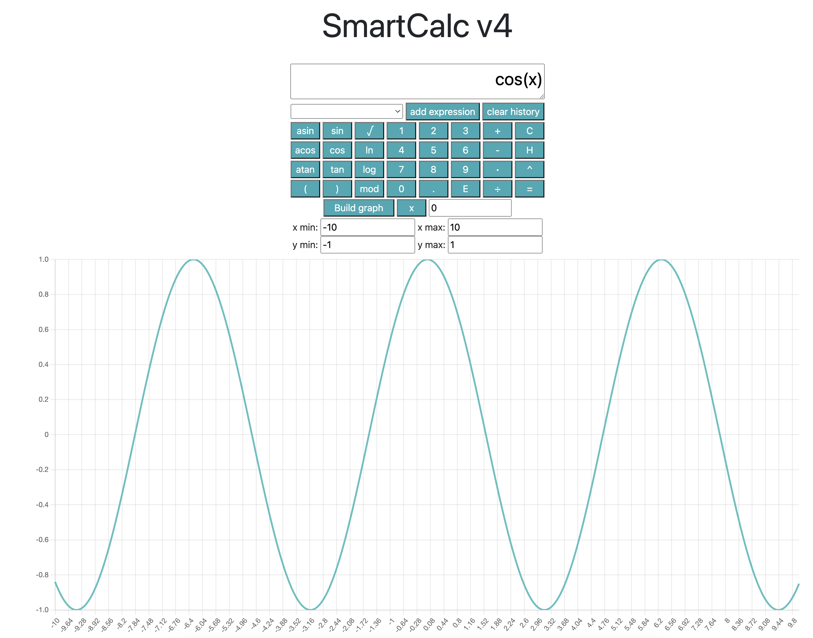

# Caluclator
В этом проекте реализован калькулятор с веб интерфейсом через ASP.NET Core MVC и бекэндом на языке С++, подключенном к С#. \
Помимо стандартных вычислений, есть возможность построить графики функции, посмотреть историю вычислений и заново использовать из неё выражение.

